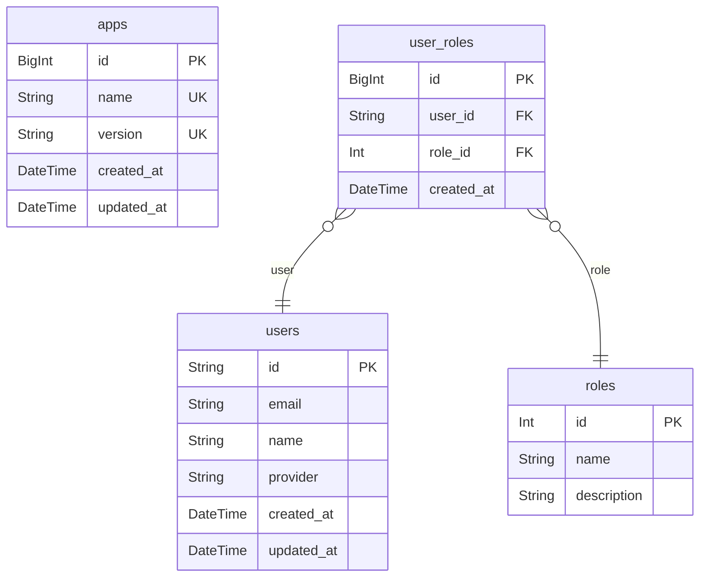

# nesetjs boilerplate prisma model

> Generated by [`prisma-markdown`](https://github.com/samchon/prisma-markdown)

- [default](#default)

## default

### `apps`

**Properties**

- `id`:
- `name`:
- `version`:
- `created_at`:
- `updated_at`:

### `users`

**Properties**

- `id`:
- `email`:
- `name`:
- `provider`:
- `created_at`:
- `updated_at`:

### `roles`

**Properties**

- `id`:
- `name`:
- `description`:

### `user_roles`

**Properties**

- `id`:
- `user_id`:
- `role_id`:
- `created_at`:
