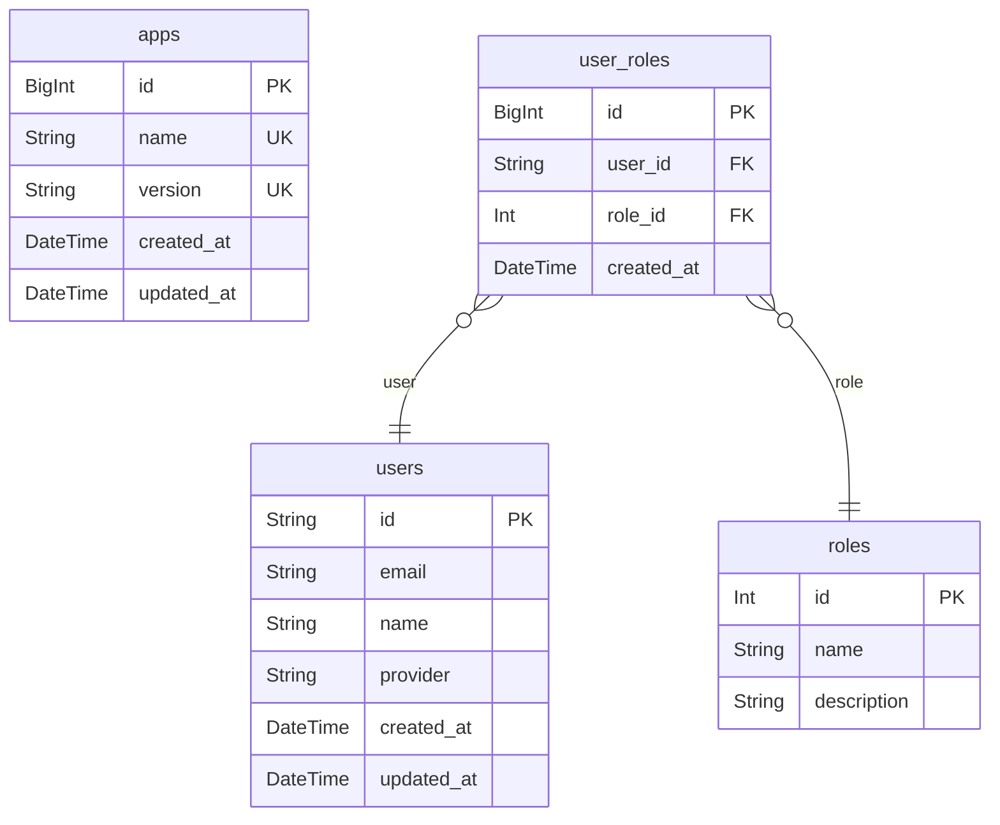

# nesetjs boilerplate prisma model

> Generated by [`prisma-markdown`](https://github.com/samchon/prisma-markdown)

- [default](#default)

## default

```mermaid
erDiagram
"apps" {
  BigInt id PK
  String name UK
  String version UK
  DateTime created_at
  DateTime updated_at
}
"users" {
  String id PK
  String email
  String name
  String provider
  DateTime created_at
  DateTime updated_at
}
"roles" {
  Int id PK
  String name
  String description
}
"user_roles" {
  BigInt id PK
  String user_id FK
  Int role_id FK
  DateTime created_at
}
"user_roles" }o--|| "users" : user
"user_roles" }o--|| "roles" : role
```

### `apps`

Properties as follows:

- `id`:
- `name`:
- `version`:
- `created_at`:
- `updated_at`:

### `users`

Properties as follows:

- `id`:
- `email`:
- `name`:
- `provider`:
- `created_at`:
- `updated_at`:

### `roles`

Properties as follows:

- `id`:
- `name`:
- `description`:

### `user_roles`

Properties as follows:

- `id`:
- `user_id`:
- `role_id`:
- `created_at`:
